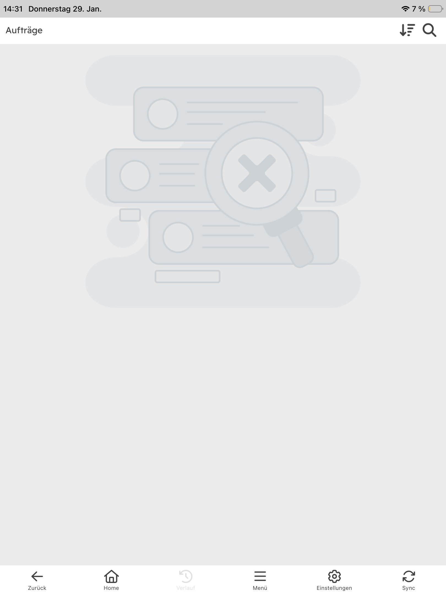
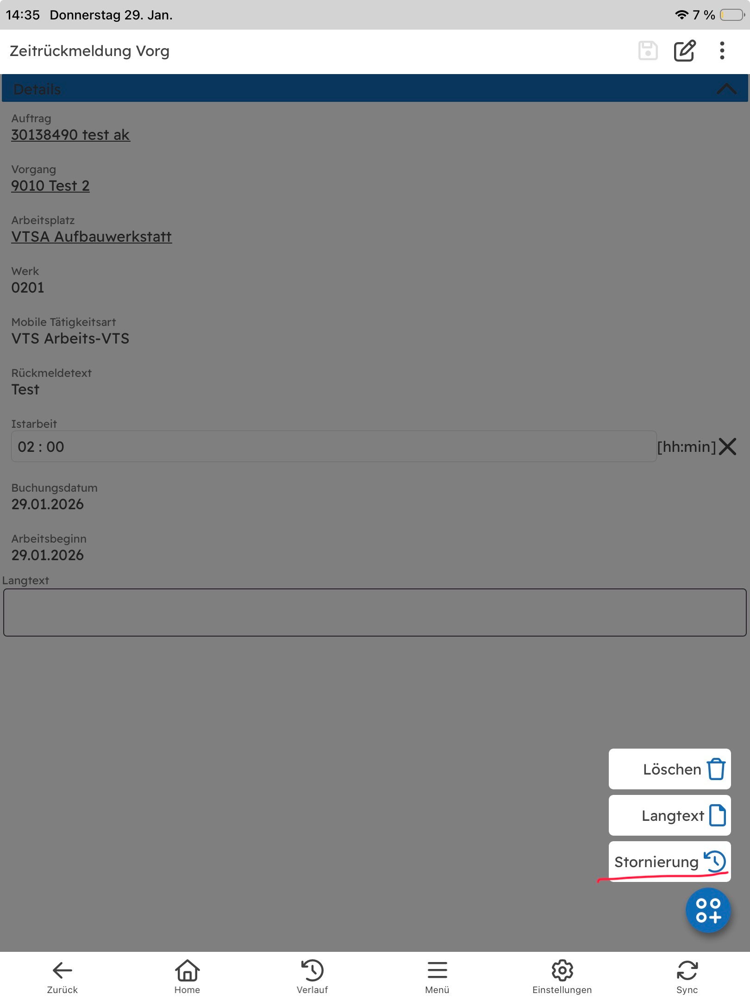

# Client Fehler - Oxando XPC

## 1. SQLite Error 5: "database is locked" - 28.01.2026

### Symptome
- Fehlermeldung: **SQLite Error 5: 'database is locked'**
- Fehler tritt beim Laden der Aufträge auf
- Betrifft die Login/Sync-Prozesse der Anwendung

### Kontext
- **Datum**: 28.01.2026
- **Auftragsart**: WS02
- **Auftragsnummer**: 30138490
- **Equipment**: ZUB-CTSM422 - Magnetische Fahrsperre CTSM Fzg. 422
- **Status**: Test aktiv

### Stack Trace
```
at Microsoft.Data.Sqlite.SqliteException.ThrowExceptionForRC(Int32 rc, sqlite3 db)
at Microsoft.Data.Sqlite.SqliteDataReader.NextResult()
at Microsoft.Data.Sqlite.SqliteCommand.ExecuteReader(CommandBehavior behavior)
at Microsoft.Data.Sqlite.SqliteCommand.ExecuteNonQuery()
at Microsoft.EntityFrameworkCore.Storage.RelationalCommand.ExecuteNonQuery(RelationalCommandParameterObject parameterObject)
at Microsoft.EntityFrameworkCore.RelationalDatabaseFacadeExtensions.ExecuteSqlRaw(DatabaseFacade databaseFacade, String sql, IEnumerable`1 parameters)
at OxandoXPC.Applications.Services.SyncProcessService.DoSyncProcess(Boolean initSyncHappened, Boolean isInitSync)
at OxandoXPC.Applications.Pages.ModalPages.LoginPage.LoginPageModel.FinishLoginProcess(Boolean initSyncHappened)
at OxandoXPC.Applications.Helpers.MainThreadHelper.<>c__DisplayClass4_0.<<CheckAndBeginInvokeOnMainThreadAsync>b__0>d.MoveNext()
--- End of stack trace from previous location ---
at System.Threading.Tasks.Task.<>c.<ThrowAsync>b__128_0(Object state)
at Microsoft.UI.Dispatching.DispatcherQueueSynchronizationContext.<>c__DisplayClass2_0.<Post>b__0()
```

### Mögliche Ursachen
- **Datenbank-Lock**: Die SQLite-Datenbank wird bereits von einem anderen Prozess/Thread verwendet
- **Sync-Konflikt**: Mehrere gleichzeitige Sync-Vorgänge könnten auf die Datenbank zugreifen
- **Nicht geschlossene Verbindungen**: Offene Datenbankverbindungen aus vorherigen Operationen

### Betroffene Komponenten
- `Microsoft.Data.Sqlite`
- `Microsoft.EntityFrameworkCore`
- `OxandoXPC.Applications.Services.SyncProcessService`
- `LoginPageModel.FinishLoginProcess`

### Screenshot

### Status
- **Offen**
- Weitere Analyse erforderlich
- Prüfen ob das Problem nach Systemspiegelung (26.-28.01.2026) noch auftritt

### Nächste Schritte
- Reproduzierbarkeit prüfen
- Datenbankzugriffe während Sync-Prozess analysieren
- Prüfen ob mehrere parallele Datenbankzugriffe stattfinden
- Connection-Handling im SyncProcessService überprüfen

---

## 2. Erweiterte Suche funktioniert nicht - iOS - 29.01.2026

### Symptome
- **Erweiterte Suche** funktioniert nicht im iOS-Gerät
- Betroffene Plattform: **iOS**
- Funktion ist nicht erreichbar oder gibt keine Ergebnisse zurück

### Kontext
- **Datum**: 29.01.2026
- **Plattform**: iOS (Mobile)
- **Version**: Maui 1.0.14454.1 / iOS 1.0.78
- **Szenario**: VTS (getestet im VTS-Szenario)

### Schritte zum Reproduzieren
1. Home Page öffnen
2. Auf **"AUFTRAG"** klicken
3. In die **Auftrags-Liste** navigieren
4. Oben auf das **Lupe-Symbol** (Suche) klicken
5. Auf **"Erweiterte Suche"** klicken
6. **Button reagiert nicht** - Erweiterte Suche öffnet sich nicht

### Fehlerbeschreibung
- Der Button für "Erweiterte Suche" ist **nicht funktional**
- Es gibt **keine Fehlermeldung**, der Button antwortet einfach nicht auf Klicks
- Die erweiterte Suche kann daher nicht verwendet werden
- **Funktioniert weder vertikal noch horizontal ** - Problem tritt in beiden Orientierungen auf

### Screenshot


### Status
- **✅ Erledigt**
- Problem wurde nach Customizing-Verteilung behoben
- Erweiterte Suche funktioniert wieder korrekt

### Nächste Schritte
- ~~Reproduzierbare Schritte ermitteln~~
- ~~Logs vom iOS-Gerät sammeln~~
- ~~Überprüfen der Suche-Implementierung in XAML/Code-Behind (iOS-spezifisch)~~
- Problem gelöst durch Customizing-Verteilung

---

## ==3. List Navigation funktioniert nicht wie im Customizing - 29.01.2026==

### Symptome
- **List Navigation** funktioniert nicht mehr gemäß Customizing-Einstellungen
- Navigation-Logik wird nicht korrekt angewendet

### Erwartetes Verhalten (Customizing)
- **0 Einträge**: Navigation soll auf das **Anlegen** gehen
- **1 oder mehrere Einträge**: Navigation soll auf die **Liste** gehen

### Aktuelles Verhalten
- Navigation funktioniert nicht entsprechend der Customizing-Konfiguration
- **Geht immer in die Eintrags-Liste**, auch wenn **eine oder mehrere Zeitrückmeldungen vorhanden sind**
- Die Navigation sollte bei vorhandenen Einträgen auf die Liste gehen, was teilweise fehlerhaft ist

### Kontext
- **Datum**: 29.01.2026
- **Version**: Windows 1.0.14454.1 / iOS 1.0.78
- **Betroffene Plattformen**: **iOS und Windows-Version**
- **Betroffene Business Objects**: 
  - BUS2128 - zeitrückmeldung
  - Matconf - Materialrückmeldung
- **Betroffener Bereich**: List Navigation Logik

### Screenshot


### Wichtiger Hinweis / Ausnahme
- **Szenarien VTV und VTE**: Bei Zeitrückmeldung verhält sich die Navigation **anders** wegen der LKW-Rückmeldung
- Dieses **abweichende Verhalten ist korrekt** und soll **so bleiben**


### Status
- **Offen**
- Bug in der aktuellen Version

### Nächste Schritte
- Customizing-Einstellungen im System überprüfen
- Navigation-Logik im Code analysieren
- Reproduzierbare Testfälle erstellen (0 Einträge vs. 1+ Einträge)
- Regression testen (in welcher Version funktionierte es zuletzt?)
- Fix implementieren und testen

---

## 4. Übersetzungsfehler "Assign Reviewer" in Auswahl Prüfer  29.01.2026

### Symptome
- **Übersetzungsfehler** in der Prüfer-Auswahl
- Titel erscheint auf **Englisch** statt Deutsch: **"Assign Reviewer"**
- Sollte auf Deutsch lauten: **"Prüfer zuweisen"** oder **"Auswahl Prüfer"**

### Kontext
- **Datum**: 29.01.2026
- **Szenario**: VTR (Checkliste)
- **Betroffene Plattformen**: **iOS und Windows-Version**
- **Betroffener Bereich**: Prüfmerkmal schließen → Auswahl Prüfer
- **Anzeige**: Dialog-Titel zeigt "Assign Reviewer" statt deutscher Übersetzung

### Schritte zum Reproduzieren
1. VTR Szenario öffnen
2. Checkliste aufrufen
3. Prüfmerkmal schließen
4. Dialog "Auswahl Prüfer" erscheint mit englischem Titel

### Screenshot


### Status
- **Offen**
- Übersetzungsfehler (Lokalisierung)

### Nächste Schritte
- Resource-Datei für Lokalisierung prüfen (de-DE)
- "Assign Reviewer" durch deutsche Übersetzung ersetzen
- Alle weiteren englischen Strings im VTR-Bereich überprüfen
- Testen mit deutscher Sprache
---

## 5. Leere Seite für 6 Sekunden beim Laden der Auftragsliste - 29.01.2026

### Symptome
- **Verzögerung beim Laden der Auftragsliste**
- Nach Klick auf "Auftrag" erscheint eine **leere Seite für ca. 6 Sekunden**
- Erst danach werden die Aufträge angezeigt
- **Performance-Problem** - deutlich längere Ladezeit als früher

### Erwartetes Verhalten
- Auftragsliste sollte **sofort** nach dem Klick auf "Auftrag" angezeigt werden
- Keine leere Seite / Wartezeit

### Aktuelles Verhalten
- Leere Seite wird für ~6 Sekunden angezeigt
- Verzögerte Anzeige der Auftragsliste

### Kontext
- **Datum**: 29.01.2026
- **Plattform**: iOS (Mobile) - **Nur iOS betroffen, Windows-Version funktioniert normal**
- **Version**: Windows 1.0.14454.1 / iOS 1.0.78

### Schritte zum Reproduzieren
1. Auf der Homepage sein
2. Auf **"AUFTRAG"** klicken
3. Leere Seite erscheint für ca. 6 Sekunden
4. Danach werden die Aufträge angezeigt

### Screenshot


### Status
- **Offen**
- Performance-Regression

### Nächste Schritte
- Ladezeit-Performance analysieren
- Vergleich mit vorheriger Version (wann funktionierte es noch schnell?)
- Überprüfen ob Daten-Caching fehlt
- Netzwerk-Requests während des Ladevorgangs analysieren
- Prüfen ob unnötige API-Calls gemacht werden
---

## 7. Action-Button "Stornierung" sollte ausgegraut sein bei nicht synchronisierten Zeitrückmeldungen - 29.01.2026

### Symptome
- Bei erfassten (noch nicht synchronisierten) Zeitrückmeldungen sind **alle Action-Buttons aktiv**
- **"Stornierung"** ist aktiv, obwohl nur **"Löschen"** möglich ist
- Techniker verwechseln die Funktionen "Löschen" und "Stornierung"
- Klick auf "Stornierung" zeigt Hinweis, dass synchronisiert werden muss

### Erwartetes Verhalten
- **"Stornierung"** sollte **ausgegraut/deaktiviert** sein, wenn die Zeitrückmeldung noch nicht synchronisiert wurde
- Nur **"Löschen"** sollte aktiv sein
- Visuell klare Unterscheidung zwischen verfügbaren und nicht verfügbaren Aktionen

### Aktuelles Verhalten
- Alle Buttons im Action-Menü sind aktiv
- "Stornierung" ist klickbar, führt aber nur zu einem Hinweis
- Keine visuelle Unterscheidung zwischen verfügbaren und nicht verfügbaren Optionen

### Kontext
- **Datum**: 29.01.2026
- **Plattform**: **iOS und Windows-Version**
- **Version**: iOS 1.0.78 / Windows 1.0.14454.1
- **Bereich**: Zeitrückmeldung - Action-Button

### Schritte zum Reproduzieren
1. Zeitrückmeldung erfassen
2. Speichern (noch **nicht synchronisieren**)
3. Erfasste Zeitrückmeldung wieder öffnen
4. Unten rechts auf **Action-Button** klicken
5. Alle Optionen werden aktiv angezeigt, auch "Stornierung"
6. Klick auf "Stornierung" zeigt Hinweis zur Synchronisierung

### Begründung
- Techniker können sich den Unterschied zwischen "Löschen" und "Stornierung" nicht merken
- Ausgegraute Buttons zeigen klar, welche Aktion möglich ist
- Reduziert Verwirrung und unnötige Klicks

### Screenshot


### Status
- **Offen**
- UX-Verbesserung

### Nächste Schritte
- "Stornierung"-Button ausgegraut darstellen, wenn Zeitrückmeldung noch nicht synchronisiert ist
- Prüfen ob gleiches Problem auch bei anderen Objekten (Materialrückmeldung etc.) besteht
- UI/UX-Logik für Action-Button-Verfügbarkeit implementieren
- Testen mit verschiedenen Rückmeldungstypen

---

## 8. KEM-233 Stornierung von Vorgängen funktioniert nicht - 03.02.2026

### Symptome
- Beim Erstellen einer **Meldung** erscheint aktuell eine **Fehlermeldung**
- **Stornierung von Vorgängen** funktioniert nicht

### Vorgang - Stornierung
- Stornierung funktioniert wie vorgesehen
- Nach Speichern muss ausgegraut sein
- Nach Sync muss funktionieren

### Kontext
- **Datum**: 03.02.2026
- **Ticket**: KEM-233

### Status
- **Offen**

### Nächste Schritte
- Fehlermeldung beim Erstellen der Meldung genauer dokumentieren (Text/Screenshot/Logs)
- Reproduzierbarkeit prüfen (Szenario + Schritte)

